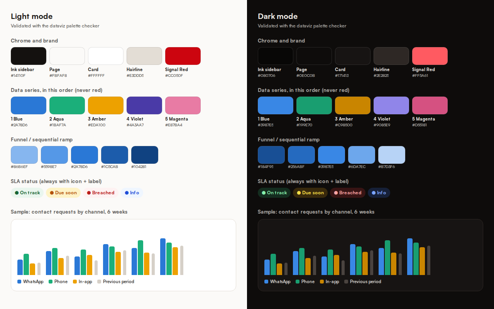

# Sawa admin console: audit and recommendations

> 24 Sep 2026 · `admin/` at `1cd1180` · audit only, no code changed.
> Method: production build of the admin console against a local backend
> seeded with six months of realistic activity (50 users, 51 submissions,
> 45 inspections, 31 collected fees, 58 contact requests), captured with
> Playwright at 1440×900 (light and dark) and 390×844; axe-core
> (WCAG 2.1 AA) on 12 pages in both themes; a code read of every page and of
> `backend/src/routes/admin.js`; the chart palette checked with the dataviz
> skill's validator. The mailbox pages were not exercised: IMAP is not
> configured in the audit environment.

---

## Verdict

The console is strong at **today's work**. It has:

- a single queue built from source-of-truth tables;
- a pipeline board;
- ⌘K search, J/K keyboard navigation and an append-only activity log;
- dark mode, and mostly clean accessibility.

It is weak at **the business view** and has **no automation**. Four gaps matter most:

1. **Analytics are thin and partly wrong.** The only time range is a fixed six months. There is no date picker, no previous-period comparison and no export. One headline metric reads **164%**.
2. **No reports.** No table in the console can be exported. No digest or statement is ever sent.
3. **No automation.** Apart from saved-search alerts (event-driven) and the uptime check, nothing runs on its own: no reminders, no SLA escalation, no digests.
4. **The visual language fights the content.** Signal Red colours data bars, so every chart reads as an alarm. 36 of 37 queue items are "Urgent". Nav icons mislabel their pages.

---

## Findings

### Correctness

| # | Finding | Where | Fix |
|---|---|---|---|
| A1 | "164% of drafts reach approval": a ratio of two stage counts at one moment, not a conversion | Action Center, Submission pipeline card | Cohort conversion: of submissions created in the period, % that reached live within N days |
| A2 | "Live listings 10 ↑15" shown twice; "↑15" beside "10" reads as a contradiction (it means 15 published this week) | Action Center | One tile; the delta labelled with its period |
| A3 | "Listings marked sold 2" has no period label (it is this month only) | Analytics | Every figure names its window |
| A4 | Activity feed shows raw ids ("Listing 4996bcb8-1d8f-…") | Action Center, Recent activity | Resolve to the car title, with a link |

### Design and usability

| # | Finding | Fix |
|---|---|---|
| D1 | Signal Red fills data bars (funnel, inventory mix, revenue by line, center throughput), against the brand rule: red is for prices, primary actions and active states | Data series palette below; red only for the primary action and SLA breaches |
| D2 | Urgency inflation: one red "Urgent" treatment for everything past 24 h, so 36 of 37 items are urgent | SLA tiers per queue: on track, due soon, breached. Red only for breached |
| D3 | Users table: four buttons on every row, including red "Suspend"; "Verify identity" offered to people who never submitted an ID | Primary action only, the rest in a row menu; verification action only when documents exist |
| D4 | Dates in US order (9/24/2026) while the product uses day-first | `en-GB` formatting everywhere |
| D5 | Pipeline board: seven narrow columns, no filters, no age sort, "Live" column holds only a count | Filters (centre, age, waiting-on), compact cards, a live-listings link |
| D6 | 21 destinations in three groups; configuration pages sit beside daily work | Five groups (below) |
| D7 | No bulk actions, no saved filters, no column sorting, no CSV export on any table | A shared table component with all four |

### Accessibility (axe-core, 12 pages × 2 themes)

- 4 inputs without labels: Inspections date filter, three numeric inputs in Settings.
- 2 selects without accessible names: Inspections filters.
- 2 contrast failures: Analytics "Needs attention" sub-text (`danger-strong/80`) and Settings card sub-text.

Everything else passes.

### Icons

The set is coherent: 52 outline glyphs on a 24 px grid at a 1.75 stroke, Lucide in style. The problems are meaning and coverage, not drawing:

| Nav item | Today | Proposed |
|---|---|---|
| Action Center | gauge | inbox-stack / list-checks |
| Pipeline | grid | kanban |
| Vehicle imports | external (a link-out arrow) | ship |
| Catalogue photos | camera | images |
| Inspections | shield-check | clipboard-check |
| Rental inquiries | calendar | calendar-clock |
| Reported chats | alert | flag |
| Activity history | clock | history |
| Home banner | star | megaphone / layout-top |
| Brands | shield | tag |
| Closures | close-circle | user-x |
| Rental inventory | key | key (keep) |
| Users & ID checks | user | id-card |
| Vehicle history | eye | file-search |
| Analytics | chart | chart-line |
| Revenue | cash | receipt |
| Centers | location | building |

Glyphs to add, drawn from Lucide paths (ISC licence, same stroke):

- **Objects:** ship, id-card, clipboard-check, flag, receipt, building, images, tag, kanban, history, file-search, users.
- **Actions and state:** download, upload, filter-sliders, zap (automation), timer (SLA), calendar-clock, list-checks, megaphone, user-x, chart-line.

The web and admin apps each keep their own copy of `Icon.tsx`, already drifting (web has `compass` and `instagram`, admin does not). One shared module would stop that.

---

## What the console should have

Every metric below comes from tables that already exist, except website traffic.

### 1. An Insights overview with a date range and a comparison

Controls: 7 d / 30 d / 90 d / 12 m / custom, and "compare to previous period", in one row above everything.

| Area | Metrics | Source tables |
|---|---|---|
| Supply | submissions, reviewed, inspections done, pass rate, listings published, median submission→live, live inventory, days on market | `submissions`, `inspections`, `cars` |
| Demand | new buyers and sellers, saves, contact requests by channel, rental inquiries, import enquiries | `users`, `saved_cars`, `listing_contact_events`, `rental_inquiries`, `import_orders` |
| Money (collected only) | fees by line, by center, by method (cash, mobile money, bank), dues outstanding, import deposits verified | `platform_fees`, `rental_subscriptions`, `import_payments` |
| Service | review SLA hit rate, ID-check age, inspection no-shows, center utilisation | `submissions`, `users`, `inspections`, `inspection_centers` |
| Traffic (missing) | visits, sources, searches, listing views over time | needs a privacy-first analytics source (decision below) |

### 2. Funnels, as cohorts

- **Seller:** submitted → reviewed → booked → inspected → passed → published → marked sold.
- **Buyer:** listing view → save → contact request (and, once traffic exists, visit → view).
- **Import:** enquiry → quoted → agreement → deposit verified → shipped → delivered.

Each step shows its conversion and median time, so the slowest step is obvious.

### 3. Inventory, quality and centres

- **Inventory:** stock by make, body type, price band and age; stale listings (no contact in 14 days); price drops.
- **Quality:** score distribution; the checklist items that fail most; rejection reasons; score spread by inspector.
- **Centers:** throughput, utilisation, pass rate and revenue per center, side by side.

### 4. Reports

- **CSV export on every table,** following the existing PII rule: contact exports never carry phone numbers.
- **Daily operations digest (email, 07:00 Kigali):** queue sizes, SLA breaches, yesterday's numbers.
- **Weekly business report (PDF):** `pdfkit` already renders documents in the backend.
- **Monthly revenue statement per line and center (PDF),** reconciled to `platform_fees`.
- **Saved views:** a filtered table or chart kept as a named link.

### 5. Automation

CLAUDE.md records "no scheduler, deliberately". The proposal keeps that spirit: automation that **reminds and reports**, never automation that moves money or publishes.

| Job | Trigger | Does |
|---|---|---|
| SLA sweeper | every 15 min | Marks queue items due soon or breached, and alerts the admin on breach |
| Seller nudges | daily | Submission approved but no inspection booked at 2 and 5 days; inspection reminder the day before |
| Import reminders | daily | Agreement awaiting acceptance; deposit or balance due; proof uploaded and awaiting review (to admin) |
| Stale listing | weekly | No contact in 14 days → suggest a price review to the seller |
| Rental subscriptions | daily | Expiry reminders at 7 and 1 days (visibility already ends by predicate) |
| Data health | daily | FX rate stale, duty schedule older than 180 days, listings with broken images |
| Closures | daily | Reminds the operator which closed accounts pass 30 days (the purge stays manual) |
| Digests and reports | daily / weekly / monthly | The reports above |

**Guardrails:**

- every automated action writes to `admin_audit_log` with the actor `system`;
- every job has an on/off switch in `platform_settings`;
- no job may publish a listing, change a price, or record a payment.

### 6. Navigation, in five groups

| Group | Pages |
|---|---|
| Today | Action Center, Inbox |
| Pipeline | Submissions, Inspections, Listings, Imports, Rentals |
| Insights | Overview, Funnels, Revenue, Centers, Reports |
| People | Users and ID checks, Reported chats, Closures |
| Configure | Platform settings, Brands, Home banner, Catalogue photos, Centers setup, Automations |

---

## Colours

The brand is unchanged: warm paper surfaces, an ink sidebar, Signal Red for the primary action.

What is new is a **data palette that never uses red**, and **SLA status colours** kept apart from it.

| Role | Light | Dark | Rule |
|---|---|---|---|
| Primary action, money headline, active nav | `#CC050F` | `#FF5A61` | Never a data series |
| Series 1 Blue | `#2A78D6` | `#3987E5` | Single-series charts use this |
| Series 2 Aqua | `#1BAF7A` | `#199E70` | |
| Series 3 Amber | `#EDA100` | `#C98500` | |
| Series 4 Violet | `#4A3AA7` | `#9085E9` | |
| Series 5 Magenta | `#E87BA4` | `#D55181` | A 6th series folds into "Other" |
| Previous period | `#D6D0C8` | `#4A433F` | Comparison bars and lines |
| Funnel ramp | `#86B6EF` → `#104281` | `#184F95` → `#B7D3F6` | One hue, light to dark |
| On track / Due soon / Breached / Info | existing success, warning, danger, info tokens | same | Always with an icon and a label |

**Validator results:**

| Check | Result |
|---|---|
| Adjacent pairs (bars, stacks, lines) | All five hues pass in both modes: lightness band, chroma floor, colour-blind separation and the normal-vision floor |
| All pairs (scatter, share charts) | The first three hues pass in both modes |
| Funnel ramps | Pass the ordinal checks in both modes |

In light mode aqua, amber and magenta sit below 3:1 on white. Charts using them must carry direct labels or a table view, which every chart gets anyway.

---

## Plan

| Phase | Scope |
|---|---|
| A. Fix and foundation | A1–A4, D1–D4, the accessibility items, icons, the palette as tokens, a shared chart kit (line with crosshair tooltip, bars, funnel, legend, table view), a shared table (sort, filters, bulk, CSV) |
| B. Insights | Overview with date range and comparison; seller, buyer and import funnels; inventory, quality and center pages |
| C. Automation and reports | Job runner, the eight jobs above with switches and audit entries, the daily digest, weekly and monthly PDFs |
| D. Traffic | First-party event capture or self-hosted analytics, then the traffic metrics and the buyer funnel's first steps |

## Decisions needed

1. **Job runner:** GitHub Actions on a schedule, calling signed internal endpoints (the pattern `uptime.yml` already uses), or a small worker container beside the API?
2. **Traffic analytics:** first-party events in Postgres (no third party, full control) or a self-hosted tool such as Plausible or Umami?
3. **Digest recipients:** the single Super Admin only, or a list?
4. **More admins:** the queue is built for one Super Admin. Should assignment and roles come now or later?
